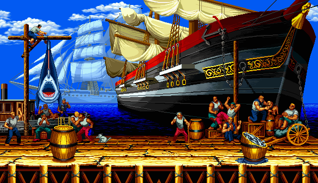
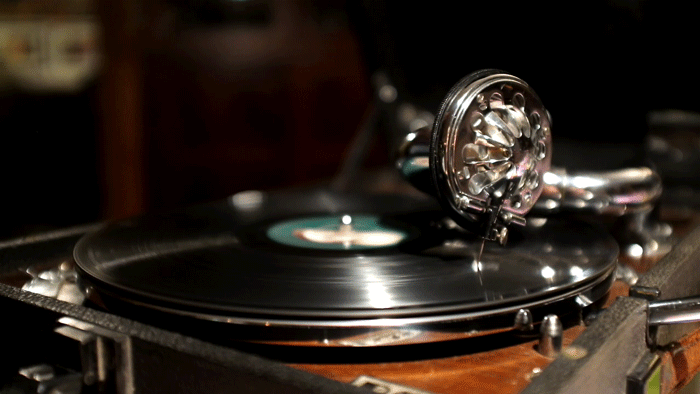

# 🎮 Remote Control Simulator

> *“One UI to control them all.”*
> A sleek Java‑Swing application illustrating the Bridge Pattern in action—switch seamlessly between TV and Media Player remotes, full‑screen GIF animations included!

---

## 🚀 Project Structure

```
project-root/
├─ src/
│  ├─ main/
│  │   ├─ java/
│  │   │    ├ BasicRemoteGUI.java
│  │   │    └ AdvanceRemoteGUI.java
│  │   └─ resources/
│  │        ├ tv.gif
│  │        ├ player.gif
│  │        └ off.png
└─ README.md
```

---

## ✨ Live Demo

1. **Choose** between **TV Remote** and **Player Remote**
2. **Full‑screen** animated GIF shows “TV ON” (blue video) or “Player ON” (rock‑video loop)
3. **Power** button toggles ON/OFF—OFF shows your custom `off.png` screen
4. **Menu → Switch Remotes** lets you swap devices anytime

<p align="center">
  
  
</p>

---

## 🏗️ Features

* **Bridge Pattern**: Decouples Remotes (abstractions) from Devices (implementations)
* **Dynamic UI**: Nimbus Look & Feel + full‑screen support
* **Rich Media**: Animated GIFs for “ON” states, custom image for “OFF”
* **Hot‑swap**: Change your remote at any time via the menu

---

## 🧩 Bridge Design Pattern Explained

The Bridge Pattern separates an abstraction from its implementation, so the two can vary independently.

### Components

1. **Abstraction**
   `abstract class RemoteNew`
   Knows only about the `DeviceNew` interface, not concrete devices

2. **Refined Abstraction**
   `class BasicRemoteNew extends RemoteNew`
   Implements high–level controls (`switchPower()`)

3. **Implementor Interface**
   `interface DeviceNew`
   Declares `on()`, `off()`, `isEnabled()`

4. **Concrete Implementors**
   `class TvNew implements DeviceNew`
   `class PlayerNew implements DeviceNew`
   Handle device–specific behavior

### UML Class Diagram (PlantUML)

<p align="center">

</p>

## 🛠️ Getting Started

1. **Clone** this repo
2. Open in **IntelliJ IDEA** (or any Java IDE)
3. Ensure **Java 11+** is on your path
4. Run either:

   ```bash
   mvn compile exec:java -Dexec.mainClass="BasicRemoteGUI"
   ```

or:

```bash
mvn compile exec:java -Dexec.mainClass="AdvanceRemoteGUI"
```

5. Enjoy your super‑powered remote!

---

## 📈 Roadmap

* 🎨 Add custom skins for remotes
* 🎮 Expand to **Volume**, **Channel**, and **Playlist** controls
* 🚀 Package as a native installer with bundled JRE

---

## 📜 License

MIT © \ Tharindu Chanaka
Feel free to remix and extend!
